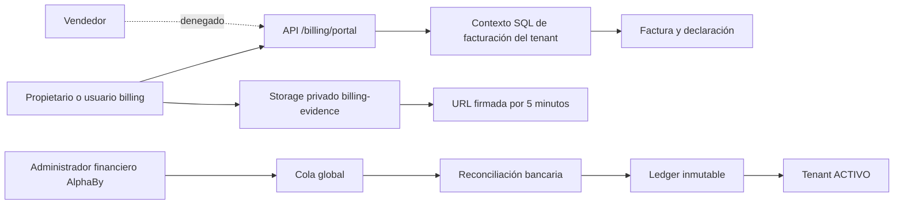

# Facturación SaaS AlphaBy: transferencia principal y PayPal opcional

## Decisiones del producto

- AlphaBy cobra a cada empresa; los cobros no pertenecen a las ventas, premios
  ni cortes internos del tenant.
- La transferencia bancaria es el canal principal. PayPal puede coexistir y se
  habilita por configuración, sin cambiar el precio canónico ni el ledger.
- Hay precios y cuentas receptoras independientes para `USD` y `NIO`. No se
  permite conversión, pago parcial ni pagar una factura en una cuenta de otra
  moneda.
- El documento emitido inicialmente es un documento comercial de cobro, no una
  factura fiscal. Su numeración `INV-AAAA-NNNNNN` es atómica y auditable.
- La empresa nace en `PENDIENTE_PAGO`. Antes de su primer pago solo el
  propietario y miembros no vendedores con permiso de facturación pueden usar
  el portal de cobros; todos los módulos operacionales permanecen bloqueados.
- El correo debe estar verificado para crear el primer documento, declarar una
  transferencia o iniciar PayPal.
- Un administrador financiero global de AlphaBy revisa manualmente la
  transferencia en la primera versión. El aprobador no necesita pertenecer al
  tenant y cada decisión queda append-only.

## Fronteras de seguridad

La API usa tres contextos SQL separados:

1. `multilot_app` para operaciones normales de un tenant activo o moroso.
2. contexto billing del tenant para propietarios o miembros con
   `puede_gestionar_facturacion=true`, incluso si el tenant está pendiente o
   suspendido;
3. contexto platform billing para `platform_admins` activos con
   `puede_revisar_facturacion=true`.

Los vendedores se rechazan expresamente aunque alguien les marque el flag de
facturación por error. Las tablas públicas tienen RLS y no están expuestas a
`anon`, `authenticated` ni `service_role` mediante PostgREST. El bucket
`billing-evidence` es privado, acepta únicamente PDF/JPEG/PNG de hasta 10 MiB y
no tiene policies de acceso cliente: solo la API sube archivos y emite URLs
firmadas de cinco minutos. Además de MIME, la API valida la firma binaria y
guarda SHA-256, tamaño y ruta.

## Modelo de datos

| Componente | Función |
| --- | --- |
| `billing_prices` | Precio canónico, monto en unidades menores, moneda e intervalo. |
| `billing_price_channels` | Activa el mismo precio para transferencia, PayPal o development. |
| `billing_bank_accounts` | Cuenta receptora AlphaBy; máximo una activa por moneda. |
| `billing_invoices` / `billing_invoice_items` | Documento comercial, período, vencimiento, gracia y detalle congelado. |
| `bank_transfer_submissions` | Declaración del cliente; por sí sola nunca acredita dinero. |
| `payment_evidence_files` | Metadatos verificables de comprobantes privados. |
| `payment_reviews` | Decisiones inmutables del revisor global. |
| `subscription_payments` | Ledger inmutable de pagos confirmados de todos los canales. |
| `subscription_payment_reversals` | Contrapartida auditable; un pago confirmado no se edita ni elimina. |
| `billing_settings` | Política central de emisión, gracia, revisión, reemisión y archivo. |
| `billing_runs` | Idempotencia y métricas de cada ciclo diario. |

Las cantidades se guardan como enteros (`monto_minor`): 2,900 significa
USD 29.00 y 106,500 significa NIO 1,065.00. La moneda del precio, factura,
declaración y cuenta debe coincidir. La referencia confirmada por el banco se
exige para aprobar.

## Ciclo de vida

### Primera mensualidad

1. `POST /billing/signup` crea usuario Auth, perfil, tenant
   `PENDIENTE_PAGO`, membresía propietaria, suscripción incompleta y onboarding.
2. El usuario confirma su correo e inicia sesión.
3. El guard normal sigue bloqueando módulos de negocio, pero el guard billing
   permite abrir `/billing/portal`.
4. `POST /billing/portal/invoices/initial` crea o devuelve la primera factura.
5. El cliente transfiere a la cuenta de la misma moneda, declara el monto exacto
   y adjunta el comprobante.
6. La evidencia cambia la declaración a `EN_REVISION` y puede pausar hasta 48
   horas una suspensión que ya estuviera por ejecutarse.
7. AlphaBy coteja su estado bancario. Una aprobación atómica marca factura
   pagada, registra el ledger, activa suscripción/tenant y emite auditoría. Un
   rechazo libera la pausa y conserva el historial.

PayPal sigue los mismos pasos hasta la factura. Si está habilitado, el portal
inicia un checkout alojado; solo un webhook PayPal autenticado puede confirmar
el dinero y converger en `subscription_payments`.

### Renovaciones y mora

El job diario emite la renovación cinco días antes del fin del período. El
vencimiento coincide con el inicio del próximo período y luego se aplican tres
días de gracia:

- durante gracia: tenant y suscripción quedan morosos, pero siguen operando;
- después de gracia: acceso operacional suspendido, portal billing disponible;
- evidencia oportuna en revisión: pausa acotada de suspensión, máximo 48 horas;
- más de 15 días de atraso: anula el documento viejo y reemite desde la fecha de
  reactivación; no regala días no pagados;
- onboarding impago expira a los 15 días y el tenant pendiente se archiva a los
  30 días.

El ciclo usa advisory lock y `run_key` diario, por lo que varios réplicas o
reintentos no duplican facturas.

## Reglas que nunca deben relajarse

- Una captura no es prueba de fondos: la aprobación exige cotejo del movimiento
  bancario real.
- No editar pagos ni revisiones; una corrección financiera usa reversión y una
  nueva operación.
- No almacenar PAN, CVV, credenciales bancarias ni estados de cuenta completos.
- No aceptar `tenant_id`, monto, moneda o estado suministrados fuera de las
  funciones SQL que los cotejan contra la factura autenticada.
- No entregar `SUPABASE_SERVICE_ROLE_KEY`, `DIRECT_URL` ni secretos de worker al
  navegador.
- El revisor AlphaBy debe usar una cuenta individual con MFA; nunca una cuenta
  financiera compartida.
